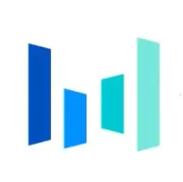
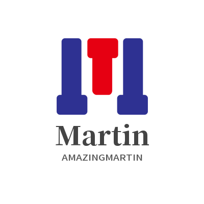

### ✨ Make the world better!!!!

<p>Hi, 👋  I'm <a href="https://blog.creativecc.cn/" target="_blank">HU CHENGCHENG </a></p>

This is my ToolKit, it must be your need 👉 [Creative.CC](https://nav.creativecc.cn/custom/common.html) 👈 || ⛏ Focus on improving personal efficiency!

🎈 [MoJio](https://mojio.creativecc.cn/) for you to enjoy!

<p><b> JackHCC/ Jack Cheng/ JackCC/ HCC</b> are all of my <em>CODE NAME</em></p>

 <em>Long time no see. <b>How are you?</b> Oh, you are a new friend. <b>Hi, Nice to meet you!</b> :)</em>

<br>

<p align="center">
  <a href="https://github.com/JackHCC" class="rich-diff-level-one">
    
    <!-- &hide=issues
    
    -->
  </a>
</p>

<p align="center">
  <a href= "https://creativecc.cn" target="_blank" alt="Toolkit" title="Toolkit">
    
  </a>
  &emsp;
  <a href="https://blog.csdn.net/qq_43042024" target="_blank" alt="CSDN" title="CSDN">
    
  </a>
  &emsp;
  <a href="https://www.zhihu.com/people/jack-c-77" target="_blank" alt="Zhihu" title="Zhihu">
    
  </a>
  &emsp;
  <a href="https://space.bilibili.com/327097999" target="_blank" alt="Bilibili" title="Bilibili">
    
  </a> 
  &emsp;
    <a href= "https://twitter.com/JackChe66021834" target="_blank" alt="Twitter" title="Twitter">
    
  </a>
  &emsp;
  <a href= "https://www.instagram.com/hcc0701/" target="_blank" alt="Instagram" title="Instagram">
    
  </a>
  &emsp;
  <a href="https://www.jianshu.com/u/f4a500314f23" target="_blank" alt="Jianshu" title="Jianshu">
    
  </a>
  <br><br>
  <strong>⚡ Check out my work below! </strong>
  <br><br>
</p>

---

### 🤡 Brief Introduction

- 🏫 I’m currently a master student on **<a href="https://www.pku.edu.cn/">Peking University</a>**, majoring in **Electronic Information**
- 🌱 My research interests include [*Natural Language Processing*](https://github.com/JackHCC/NLP-Bubble), [*Quantum*](https://github.com/JackHCC/Quantum-Neural-Network) [*Holography*](https://github.com/JackHCC/Computer-Generated-Hologram), [*Advertising Strategy*](https://github.com/JackHCC/Awesome-Uplift-Model) *and* [*Models*](https://github.com/JackHCC/Rec-Models)
- 📫 You can get in touch with me by email at [jackcc0701@163.com](mailto:jackcc0701@163.com)
- 🎈 Have a fun to [Relax](https://blog.creativecc.cn/iCreate-GuitarSimulator/index) ! [(⊙ˍ⊙)？](https://www.bilibili.com/video/BV1HC4y1x7ek/)

---

### 📗 Education Experience

[](https://www.pku.edu.cn/)

**Graduate Student** \
[**PKU**](https://www.pku.edu.cn/) • 2021/09/01 - Now \
Skills: `Python`, `Natural Language Processing`, `Computer Vision`, `Embedded System`, `Verilog`, `Assembly`, `etc.` \
Featured Projects: [PKU Lessons Summary](https://github.com/JackHCC/PKU-Lessons-Summary) / [DL Models](https://github.com/JackHCC/Awesome-DL-Models)
<br/>


[](https://www.ustb.edu.cn/)

**Bachelor Degree** \
[**USTB**](https://www.ustb.edu.cn/) • 2017/09/01 - 2021/07/01 \
Skills: `Communication Principle`, `Signals and Systems`, `Digital Signal Processing`, `Machine Learning`, `Deep Learning`, `Computer Network`, `etc.` \
Featured Projects: [Graduation Design](https://github.com/JackHCC/Graduation-Design) / [USTB Lessons Summary](https://github.com/JackHCC/USTB-miniPaper)
<br>

### ⛳ Work Experience

[](https://www.pku.edu.cn/)

**Research Student** \
[**Spatial Image Processing Lab**](https://ygl.creativecc.cn/) • 2022/07/01 - Now \
Research Interests: `Holography`, `Computer Generated Hologram`, `Quantum Computation`, `Image Compression`  \
Featured Projects: [Quantum Neural Network](https://github.com/JackHCC/Quantum-Neural-Network) / [CGH](https://github.com/JackHCC/Computer-Generated-Hologram) / Quantum Holography
<br>

[](https://www.bytedance.com/)

**Advertising Strategy Algorithm Intern** \
[**ByteDance**](https://www.bytedance.com/) • 2022/07/11 - Now \
Languages & Technologies: `Python`, `Go`, `C++`, `Advertising Strategy Algorithm`, `Casual ML`, `Uplfit Modeling`, `Ranking`  \
Featured Projects: MSDB / Razor / [Awesome Uplift Model](https://github.com/JackHCC/Awesome-Uplift-Model) / [Rec-Models](https://github.com/JackHCC/Rec-Models)
<br>

[](https://www.didiglobal.com/)

**NLP Algorithm Intern** \
[**DiDi**](https://www.didiglobal.com/) • 2022/03/22 - 2022/06/23 \
Languages & Technologies: `Python`, `Natural Language Processing`, `Event Extraction`, `Question Answering System`, `KeyPhrase Extraction`  \
Featured Projects: KBQA / IRQA / [KeyPhrase Extraction](https://github.com/JackHCC/Chinese-Keyphrase-Extraction)
<br>

[](http://www.starcross.cn/)

**System Security R&D Engineer** \
[**StarCross**](http://www.starcross.cn/) • 2021/04/19 - 2021/11/30 \
Languages & Technologies: `Python`, `Java`, `Rust`, `Linux`, `Operating System`, `Linux Kernel`, `Binary Security`, `Function Detection`, `Redis` \
Featured Projects: [Ghidracraft](https://github.com/StarCrossPortal/ghidracraft) / [Binary Code Similarity Detection(Part)](https://github.com/JackHCC/Pcode-Similarity) / [Awesome-BCSD](https://github.com/JackHCC/Awesome-Binary-Code-Similarity-Detection-2021)
<br>


---
 

**Languages and Frameworks**

<code></code>
<code></code>
<code></code>
<code></code>
<code></code>
<code></code>
<code></code>
<code></code>
<code></code>
<code></code>
<code></code>
<code></code>

**Tools and Environments**

<code></code>
<code></code>
<code></code>
<code></code>
<code></code>
<code></code>
<code></code>
<code></code>
<code></code>
<code></code>
<br>

**Design**

<code></code>
<code></code>
<code></code>
<code></code>
<code></code>
<code></code>


### 📊 This Week I Spent My Time On:
<!--START_SECTION:waka-->

```text
Python     6 hrs 35 mins   ████████████████████████▓   98.26 %
Jupyter    6 mins          ▒░░░░░░░░░░░░░░░░░░░░░░░░   01.64 %
ReST       0 secs          ░░░░░░░░░░░░░░░░░░░░░░░░░   00.08 %
Markdown   0 secs          ░░░░░░░░░░░░░░░░░░░░░░░░░   00.03 %
```

<!--END_SECTION:waka-->


---

### 🏆 Projects

[](https://github.com/CrashKingOrz/ppReader-Kernel)

**ppReader Platform** \
[**ppReader**](https://github.com/CrashKingOrz/ppReader-Kernel) • An AI powerful point reading system platform. \
Languages & Technologies: `Python`, `Paddle`, `OpenCV`, `MediaPipe`, `Yolo`\
Project Display: [Video](https://www.bilibili.com/video/BV1j94y1d7kC/) / [Server](https://github.com/CrashKingOrz/ppReader-Server) / [Web](https://github.com/CrashKingOrz/ppReader-Web) / [Wx Program](https://github.com/CrashKingOrz/ppReader)
<br>

[](https://github.com/CrashKingOrz/AmazingMartin)

**AmazingMartin** \
[**AmazingMartin**](https://github.com/CrashKingOrz/AmazingMartin) • A wonderful virtual dressing room application based on GAN. \
Languages & Technologies: `Python`, `GAN`, `OpenCV`\
Project Display: [Video](https://www.bilibili.com/video/BV15W4y167vb) 
<br>

[](https://github.com/JackHCC/SaferGo)

**SaferGo Software** \
[**SaferGo**](https://github.com/JackHCC/SaferGo) • A real-time safety travel app that guards you. \
Languages & Technologies: `Java`, `Android`, `Javascript`, `SQL`, `Nodejs` \
Project Display: [Video](https://www.bilibili.com/video/BV1jE411w7T4/) / [Web](https://blog.creativecc.cn/Web-SaferGo/)
<br>

[](https://github.com/JackHCC/BabyBox)

**BabyCare System** \
[**BabyCare**](https://github.com/JackHCC/BabyBox) • Real-time baby care Internet of Things system. \
Languages & Technologies: `Java`, `Android`, `Javascript`, `Ardunio`, `MQTT`, `MongoDB`, `C/C++`, `Nginx`\
Project Display: [Video](https://www.bilibili.com/video/BV1pE411w71e/) / [BabyCareOrz](https://github.com/babycareorg) / [Web](https://blog.creativecc.cn/Web-BabyCare/)
<br>


---

### 🌏 My Organization
<a href="https://github.com/Cheer-for-fun">
    
</a>
<a href="https://github.com/CrashKingOrz">
    
</a>
<a href="https://github.com/sspkudx">
    
</a>
<a href="https://github.com/SIPL-pku">
    
</a>
<a href="https://github.com/babycareorg">
    
</a>

<br>

🤝 Let's do some interesting projects together 👆!!!

---

### 🔭 I am an Astrophile

<p>❤❤❤❤❤❤ I have a <a href="https://blog.creativecc.cn/SkyDream/">SkyDream</a> ❤❤❤❤❤❤ ✔ !</p>
<p>❤❤❤❤❤❤ I designed <a href="https://github.com/JackHCC/SkyDream">Here</a> ❤❤❤❤❤❤ 😄.</p>

🧤 If you like what I do, let's make a [**Friend**](https://blog.creativecc.cn/friends/)! 👉 [Free Tools](https://creativecc.cn/index/index.html) 👈  

👩🏼‍🤝‍🧑🏻 Let's study and make progress together 👉 [Go](https://blog.creativecc.cn/) !!! 

---

